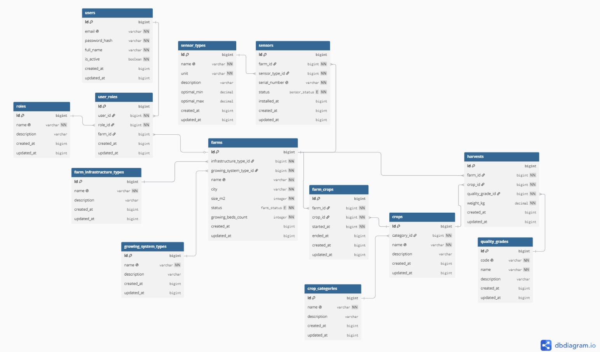

# Database Setup

## Overview

The system uses PostgreSQL to store and manage application data. When the PostgreSQL Docker container is started for the first time, the initialization scripts automatically create the database structure and load the initial seed data.

---

## Docker Setup

The PostgreSQL database runs inside a Docker container defined in `docker-compose.yaml`.

### Service Configuration

* PostgreSQL version: 16
* Container name: `urbangreen-postgres`

### Environment Variables

The database connection settings are configured in the `.env` file:

- `POSTGRES_USER`
- `POSTGRES_PASSWORD`
- `POSTGRES_DB`
- `POSTGRES_PORT` (default `5432`)

### Volumes

| Volume                        | Purpose                                        |
| ----------------------------- | ---------------------------------------------- |
| `/var/lib/postgresql/data`    | Persistent database storage                     |
| `/docker-entrypoint-initdb.d` | Database initialization scripts                |
| `/data`                       | Seed data files used during initialization     |

### Initialization Scripts

SQL scripts located in `infra/postgres/init` are automatically executed during the initial database setup.

### Starting the Database

Start the database:

```bash
sudo docker compose up -d
```

Check container status:

```bash
sudo docker ps
```

View logs:

```bash
sudo docker compose logs -f postgres
```

Stop the database:

```bash
sudo docker compose down
```

### Rebuilding the Database

To completely recreate the database and rerun all initialization scripts:

```bash
sudo docker compose down -v
sudo docker compose up -d
```

Removing the volume deletes all persisted PostgreSQL data.

---

## Database Initialization

The database initialization process is split into two scripts (in folder `infra/postgres/init`) to separate schema creation from data seeding.

### 01_schema.sql

Creates all database objects, including:

* `app` schema
* enums
* tables
* foreign keys
* indexes

This script defines the complete database structure.

### 02_seed.sql

Populates the database with initial reference and seed data.

The script inserts:

* roles
* sensor types
* quality grades
* infrastructure types
* growing system types
* farms
* crop categories
* crops

It also:

* synchronizes sequences using `setval(...)`
* imports harvest data from a compressed CSV file
* generates sensors for all farms
* creates farm-crop assignments


## Database Design

The database is designed to support farm management, crop cultivation, sensor monitoring and harvest tracking.

The schema is organized into:

- User and role management (`users`, `roles`, `user_roles`)
- Farm management and configuration (`farms`, `farm_infrastructure_types`, `growing_system_types`)
- Crop catalog and cultivation tracking (`crop_categories`, `crops`, `farm_crops`)
- Sensor management and monitoring (`sensor_types`, `sensors`)
- Harvest tracking and quality grading (`harvests`, `quality_grades`)


### Entity Relationship Diagram

The diagram below shows the structure of the database and relationships between entities.




### Key Relationships

Key relationships within the database include:

* A farm belongs to an infrastructure type and a growing system type.
* A farm can contain multiple sensors.
* A farm can grow multiple crops.
* A crop can be grown on multiple farms.
* A user can have different roles on different farms.
* Harvest records are linked to farms, crops, and quality grades.


---

## Connecting to the Database

Connection values are defined in the project's `.env` file.

### Using a PostgreSQL Client

Connect using any PostgreSQL client (e.g. DBeaver, DataGrip, pgAdmin) with the following settings:

| Property | Value |
|-----------|--------|
| Host | localhost |
| Port | POSTGRES_PORT (default: 5432) |
| Database | POSTGRES_DB |
| Username | POSTGRES_USER |
| Password | POSTGRES_PASSWORD |


### Using the Docker Container

Connect directly to PostgreSQL from inside the container:

```bash
sudo docker exec -it urbangreen-postgres psql -U <POSTGRES_USER> -d <POSTGRES_DB>
```
